# Экспорт/Импорт

Часть приложений не имеет встроенных средств интеграции или связь с внешним миром из за политики безопасности компаний, но имеют возможность экспортировать или импортировать данные в разных форматах. 
Для того что бы интегрироваться с ними устанавливают промежуточное программное обеспечение, которое занимается трансляцией и синхронизацией данных. Содержать серверы интеграции или использовать готовые облачные решения  может оказаться довольно дорого, особенно, если данные изменяются редко и транзакций не так много. Для этого отлично подходит "экспорт/импорт" как средство интеграции. Можно выгружать из внешней системы данные, производить небольшие изменения и загружать их в StoryCLM. Аналогично можно поступать и в обратном порядке. Две системы обмениваются данными без лишних затрат, обеспечивая относительно хорошую надежность.

"Экспорт/Импорт" позволяют выгружать и загружать данные напрямую в таблицу в одном и четырех популярных форматов: json, xml, csv и excel.

Средства импорта и экспорта находятся в разделе "[Таблицы](TABLES.md)" на панели управления StoryCLM:

В разделе "[Таблицы](TABLES.md)" выбрать нужную таблицу из списка:

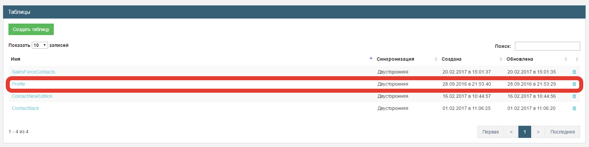

На панели "Данные" находятся кнопки экспорта и импорта:

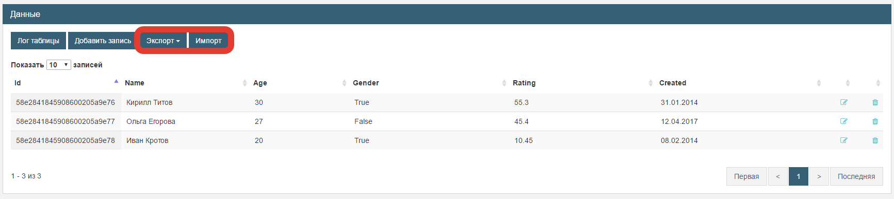

## Экспорт

При нажатии на копку "Экспорт" появится контекстное меню. Можно выбрать один и четырех форматов данных:

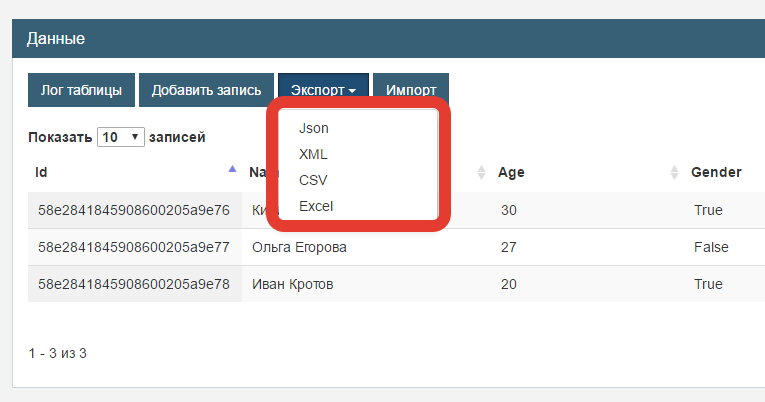

При экспорте создается файл, в одном из перечисленных выше форматов согласно схеме таблицы, и сохраняется на локальный компьютер.
Данные выгружаются всегда коллекцией, даже если в таблице всего один объект или таблица пуста. 

Пример экспорта в json:

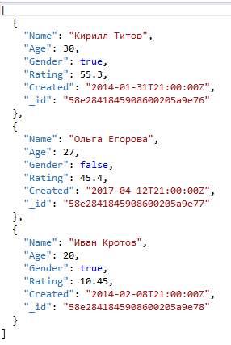

Пример экспорта в xml:

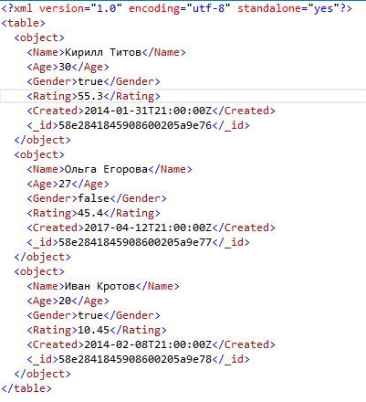

Пример экспорта в csv:

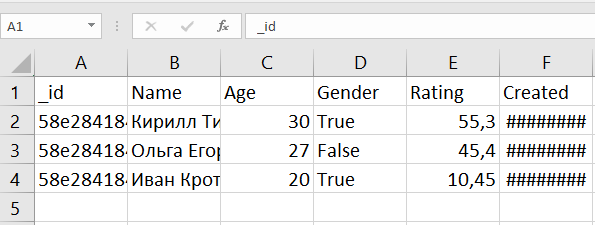

Пример экспорта в excel:

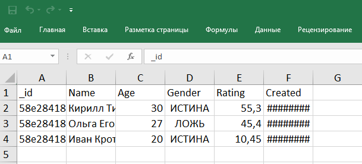

## Импорт

Импорт - это механизм загрузки данный в таблицу согласно схеме таблицы. StoryCLM поддерживает импорт из четырех форматов: json, xml, csv, excel.

Для всех форматов у операции импорта существуют общие особенности:

1. Файл импорта должен иметь кодировку UTF-8.
2. Поле _id будет проигнорировано если оно встретится в документе.
3. Операция импорта массовая. Это значит что обработка данных происходит коллекциями (массивами) данных. Это касается форматов json и xml. Даже если нужно импортировать в таблицу один объект его нужно поместить в массив.
4. Для табличных форматов (csv, excel)  обязателен заголовок. Заголовок должен соответствовать схеме таблицы. 
5. Расширения файла должно соответствовать его типу. 

**Особенности импорта данных в формате json.**

Все объекты должны быть помещены в массив, даже если нужно импортировать только один объект.

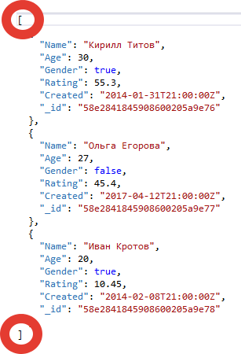

Каждый объект должен соответствовать схеме таблицы. Это означает что название полей, их количество и тип данных каждого поля должен быть соответствовать схеме.

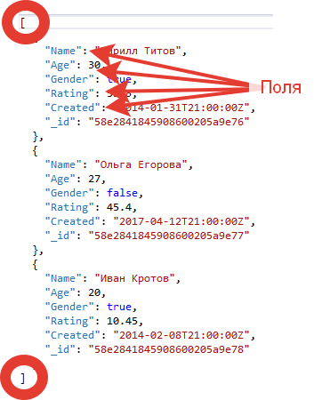

**Особенности импорта данных в формате xml.**

Все элементы описывающие объект должны быть помещены в элемент "table", даже если нужно импортировать только один объект.
Сами поля должны быть дочерними элементами элемента object. Каждый объект должен соответствовать схеме таблицы. Это означает что название полей, их количество и тип данных каждого поля должен быть идентичен схеме. Иерархия элементов должна выглядеть следующим образом:

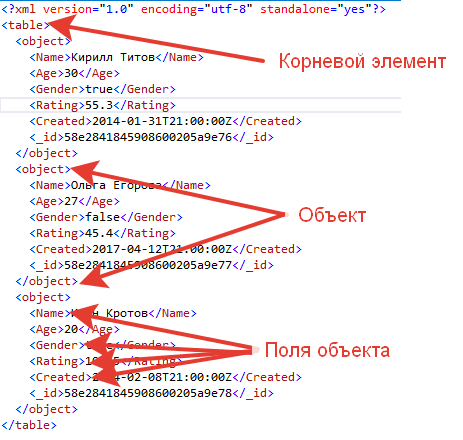

**Особенности импорта данных в формате csv и excel.**

Csv и excel - это табличные форматы данных. Для импорта таких данных в таблицу, необходимо использовать первую строку как заголовок.
Это означает что название столбцов идентично названию полей в схеме.

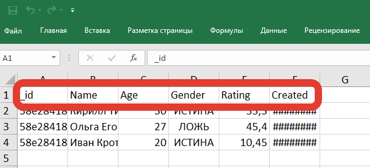

Количество столбцов должно быть равным количеству полей в схеме. Каждый столбец должен хранить данные определенного типа, которому он соотвесвует в схеме таблицы.
Столбец "_id" не обязателен и при наличии оного будет игнорироваться.

### Загрузка

Для того что бы загрузить данные в таблицу необходимо нажать на кнопку "Импорт". Появится модальное окно загрузки данных в таблицу.

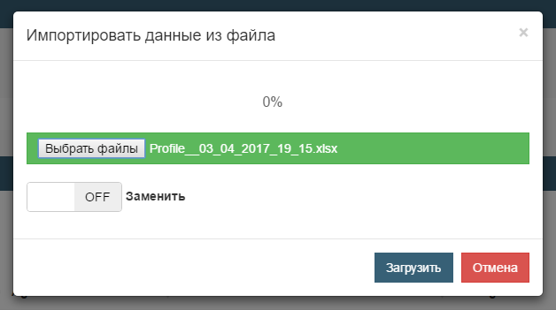

Следует выбрать файл импорта в одном из четырех форматов. Формат файла должен соответствовать его расширению.
Если нужно заменить все данные в таблице то переключатель "Заменить" следует перевезти в режим "ON".
Все данные будут удалены и на их место будут загружены данные из файла импорта. В противном случае, новые данные будут добавлены к уже имеющимся.
Для того что бы выполнить импорт, нужно нажать на кнопку "Загрузить" и дождаться окончания выполнения операции.

Данные экспорта и импорта для каждого формата идентичны по структуре.
Если пред забить таблицу тестовыми данными и сделать экспорт, то можно получить готовый шаблон для импорта.

## Шаблонизация

Шаблонизация - это процесс разделения логики программы и данных. Шаблонизатор по определенным правилам комбинирует шаблон с моделью данных. В результате получается готовый документ, сайт или презентация. Реализация шаблонизаторов может резко отличатся, но основные принципы остаются неизменными.

Данные, как правило, хранятся в удобных и понятных для менеджера форматах, например в excel документах. Для того что бы создать презентацию необходимо просто запустить шаблонизатор 
и данные, по определенным ключам, наложатся на шаблон и полчутся готовая презентация. Для изменения презентации, менеджеру нужно изменить необходимые поля в документе и перезапустить процесс.
Такой подход помогает исключить "кошмар правок",  когда что бы внести незначительные изменения, необходима прибегать к услугам программистов и слайды просто перевертываются. Это приводит большим трудозатратам.

Разделение на бизнес логику и данные в презентации имеет ряд существенных преимуществ. Но это касается только определенных типов презентаций:

1. Презентация с локализацией. Одна презентация - много языков.
2. Тесты и опросы. Одна бизнес логика - разные данные.
3. Стилизация. Одна структура презентации и логика но разный стиль. Например, цветовая схема.

StoryCLM позволяет разделять логику презентаций и данные, используя таблицы. 

