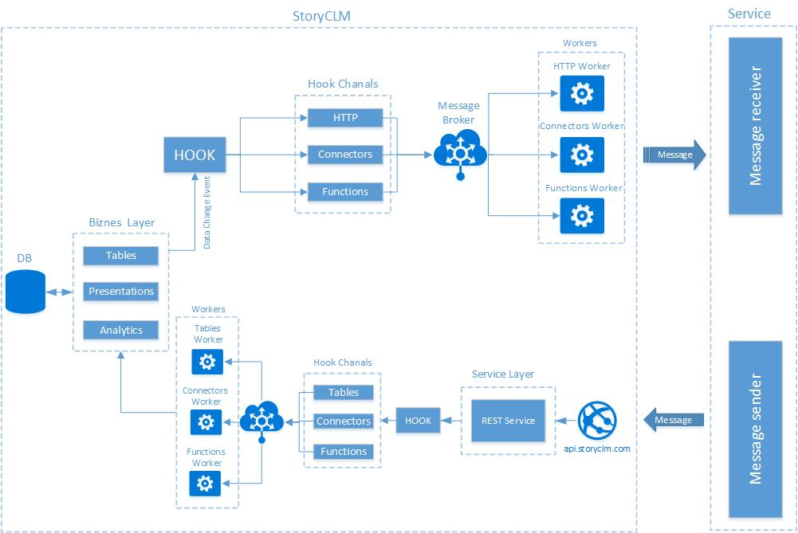

# Story Hooks

## Общие сведения

StoryCLM Hooks позволяет построить интеграцию на основе обмена сообщениями, когда две системы подписываются на события друг друга. Как только событие возникает в одной из систем, то она посылает сообщение в другую систему по одному из каналов, вторая система получает событие и обрабатывает данные, пришедшие вместе с ним. Тем самым, два приложения могут обмениваться данными асинхронно в режиме реального времени. Например, когда в таблицу StoryCLM добавляются новые объекты, срабатывает событие и запускается исходящий хук, который отправит данные в сторонний сервис. Обычно, данные передаются по протоколу HTTP методом POST в формате JSON на заранее сконфигурированный URL. В StoryCLM реализованы входящие и исходящие хуки. Так же система поддерживает разные каналы для отправки и получения сообщений.

Принципиальная схема:



Хуки бывают двух видов - исходящие и входящие. Входящий хук получает и обрабатывает сообщения пришедшие от сторонних приложений и сервисов. Исходящий хук вызывается событием системы и отправляет сообщения по разным каналам во внешние сервисы и приложения.

## Исходящий хук

Исходящий хук отправляет данные в один из каналов после того как в StoryCLM сработает событие на которое этот хук был подписан. В системе есть список событий которые она отслеживает. Это может быть изменение данных в таблице, создание новой презентации, отправка данных из планшета и т.д. После того как срабатывает событие, система ищет хук, который подписан на это событие. Если хук найден то формируется контекст хука и хук активируется. Контекст это набор данных, которые описывают само событие (если событие - это изменения объекта в таблице, то данные - это информация о таблице плюс измененный объект) и хук. Хук отправляет данные в указанный в настройках выбранный канал. На другом конце канала данные обрабатываются. Стоит отметить, что исходящий хук ничего не знает о обработчике на другом конце канала. 

На схеме показан принцип работы исходящего хука:


### События

Событие - это сообщение, которое возникает в StoryCLM при изменении или передаче данных. Это сообщение представлено в системе как объект StoryEvent и имеет следующие обязательные поля:
 
  1. EventId - уникальный идентификатор события в системе.
  2. EventName - название события.
  3. Data - данные, которое приходят вместе с событием, контекст события.


В зависимости от события, объект может расширяться дополнительными полями, относящимся у конкретному событию. При срабатывании события, система ищет хуки, которые были подписаны на обработку этого события. Если хук найдет то при его запуске ему передается как контекст сообщение StoryEvent. 

В StoryCLM, в открытом доступе находятся восемь событий:

 1. Presentation (Create) - создание презентации.
 2. Presentation (Delete) - удаление презентации.
 3. Presentation (Update) - обновление презентации.
 4. Tables (Create) - создание новой таблицы.
 5. Tables (Delete) - удаление таблицы.
 6. Tables (Insert) - добавление нового объекта в таблицу.
 7. Tables (Remove) - удаление объекта из таблицы.
 8. Tables (Update) - обновление существующего объекта таблицы.

 
**Presentation (Create).** Возникает когда в системе создается новая презентация. Событие несет в себе объект Presentation который описывают новую презентацию:
```
{
  "Username": "rsk-k161@hotmail.com",
  "Created": "2017-05-10T12:08:53.6473992+00:00",
  "Data": {
    "ClientId": 20,
    "Created": "2017-05-10T12:08:53.133",
    "Id": 4905,
    "LongDescription": null,
    "Name": "Test",
    "Order": 0,
    "Revision": 0,
    "ShortDescription": null,
    "Skip": false,
    "DebugModeEnabled": true,
    "Updated": "2017-05-10T12:08:53.3191518+00:00",
    "MapEnabled": false,
    "MapType": 0,
    "NeedConfirmation": false,
    "PreviewMode": 0,
    "Map": null
  },
  "EventId": 6,
  "EventName": "Presentation (Create)"
}
```

**Presentation (Delete).** Возникает когда в системе удаляют презентацию. Событие несет в себе объект Presentation который описывают презентацию:
```
{
  "Username": "rsk-k161@hotmail.com",
  "Created": "2017-05-10T12:11:35.6246227+00:00",
  "Data": {
    "ClientId": 20,
    "Created": "2017-05-10T12:08:53.133",
    "Id": 4905,
    "LongDescription": null,
    "Name": "Test UP",
    "Order": 0,
    "Revision": 1,
    "ShortDescription": null,
    "Skip": false,
    "DebugModeEnabled": true,
    "Updated": "2017-05-10T12:10:55.417",
    "MapEnabled": false,
    "MapType": 0,
    "NeedConfirmation": false,
    "PreviewMode": 0,
    "Map": null
  },
  "EventId": 8,
  "EventName": "Presentation (Delete)"
}
```

**Presentation (Update).** Возникает при редактировании презентации или изменении контента. Событие несет в себе объект Presentation который описывают презентацию:
```
{
  "Username": "rsk-k161@hotmail.com",
  "Created": "2017-05-10T12:10:55.48103+00:00",
  "Data": {
    "ClientId": 20,
    "Created": "2017-05-10T12:08:53.133",
    "Id": 4905,
    "LongDescription": null,
    "Name": "Test UP",
    "Order": 0,
    "Revision": 1,
    "ShortDescription": null,
    "Skip": false,
    "DebugModeEnabled": true,
    "Updated": "2017-05-10T12:10:55.4184789+00:00",
    "MapEnabled": false,
    "MapType": 0,
    "NeedConfirmation": false,
    "PreviewMode": 0,
    "Map": null
  },
  "EventId": 7,
  "EventName": "Presentation (Update)"
}
```

**Tables (Create).** Возникает когда создается новая таблица. Событие несет в себе объект Table который описывают таблицу и несет в себе ее схему:
```
{
  "TableId": 45,
  "TableName": "Test",
  "Data": [
    {
      "k": "Name",
      "t": 1
    },
    {
      "k": "Age",
      "t": 2
    }
  ],
  "EventId": 4,
  "EventName": "Tables (Create)"
}
```

**Tables (Delete).** Происходит когда таблица удаляется. Событие несет в себе объект Table который описывают таблицу и несет в себе ее схему:
```
{
  "TableId": 45,
  "TableName": "Test",
  "Data": [
    {
      "k": "Name",
      "t": 1
    },
    {
      "k": "Age",
      "t": 2
    }
  ],
  "EventId": 5,
  "EventName": "Tables (Delete)"
}
```

**Tables (Insert).** Возникает когда в таблицу добавляется объект или группа объектов. В зависимости от этого событие может нести в себе один добавленный объект или группу объектов. Это нужно учитывать при обработке сообщения.
```
{
  "TableId": 44,
  "TableName": "Contacts",
  "Data": {
    "Id": null,
    "Name": "Test",
    "Company": null,
    "Email": null,
    "Phone": null,
    "Interest": null,
    "_id": "59130687bc977f176c6e6e7b"
  },
  "EventId": 1,
  "EventName": "Tables (Insert)"
}
```

**Tables (Update).** Возникает когда в таблице происходит обновление объекта или группы объектов. В зависимости от этого событие может нести в себе один объект или группу объектов. Это нужно учитывать при обработке сообщения.
```
{
  "TableId": 44,
  "TableName": "Contacts",
  "Data": {
    "Id": null,
    "Name": "Test",
    "Company": "Test",
    "Email": "Test",
    "Phone": "Test",
    "Interest": "Test",
    "_id": "59130687bc977f176c6e6e7b"
  },
  "EventId": 2,
  "EventName": "Tables (Update)"
}
```

**Tables (Remove).** Возникает при удалении объекта или группы объектов. В зависимости от этого событие может нести в себе один объект или группу объектов. Это нужно учитывать при обработке сообщения.
```
{
  "TableId": 44,
  "TableName": "Contacts",
  "Data": {
    "Id": null,
    "Name": "Test",
    "Company": "Test",
    "Email": "Test",
    "Phone": "Test",
    "Interest": "Test",
    "_id": "59130687bc977f176c6e6e7b"
  },
  "EventId": 3,
  "EventName": "Tables (Remove)"
}
```

При возникновении события при условии, что найден подписанный на это событие хук, он будет инициализирован и запущен. Далее хук перенаправит данные пришедшие с событием в указанный в настройках хука канал. 

### Каналы

Канал - это абстракция, представляющая из себя шину данных и набор обработчиков определенного типа. При выборе канала, как правило, необходимо задать существующий обработчик или URL. Хук отправит сообщение-событие указанному обработчику. Обработчик должен поддерживать обработку данных пришедших от хука. В StoryCLM для исходящих хуков имеется три канала:

 1. HTTP.
 2. Connectors.
 3. Functions.

**HTTP.** Используется для отправки данных по протоколу HTTP на указанный в настройках хука URL методом POST. 

**Connectors.** При использовании канала, нужно выбрать существующий обработчик-коннектор. Стоит отметить что коннектор должен иметь возможность получать данных от хука. Такая возможность зашивается в коннектор самим разработчиком.

## Входящий хук

Входящий хук принимает сообщения от сервисов и приложений. В StoryCLM можно отправить сообщение, используя хук, только через REST или WebSockets API.

При создании входящего хука, генериуется идентификатор хука и ключ. В случае, если данные будут передаваться по HTTP каналу, после создания входящего хука создается URL. Это будет конечная точка хука. На этот URL сервис или приложение будет посылать сообщение по протоколу HTTP методом POST. Если используется WebSockets API, то для отправки сообщения достаточно знать идентификатор хука и ключ. 

StoryCLM  получает сообщения на конечную точку. Далее система ищет хук и создает контекст. При активации, хук получает контекст в виде его настроек и полученных от внешнего сервиса данных. В зависимости от настроек, хук перенаправляет сообщение в нужный канал и запускает обработчик.

На схеме показан принцип работы входящего хука:


### Каналы

Канал - это абстракция, представляющая из себя шину данных и набор обработчиков определенного типа. При выборе канала, как правило, необходимо задать существующий обработчик. Обработчик должен поддерживать обработку данных пришедших от хука. В StoryCLM для входящих хуков имеется три канала:

1. Connectors.
2. Functions.
3. Tables.

**Connectors.** При использовании канала, нужно выбрать существующий обработчик-коннектор. Стоит отметить что коннектор должен иметь возможность получать данных от хука. Такая возможность зашивается в коннектор самим разработчиком.

**Tables.** Канал таблиц. Посылая в этот канал сообщения, можно добавлять, редактировать или удалять объекты в таблице. Поддерживаются как одиночные операции так и групповые. Канал принимает сообщения в формате JSON. Структура сообщения зависит от схемы таблицы. 

В качестве примера, можно рассмотреть таблицу "Contacts" и ее схему:
```
{
  "Type": 0,
  "Name": "Contacts",
  "Schema": [
    {
      "k": "Id",
      "t": 2
    },
    {
      "k": "Name",
      "t": 1
    },
    {
      "k": "Company",
      "t": 1
    },
    {
      "k": "Email",
      "t": 1
    },
    {
      "k": "Phone",
      "t": 1
    },
    {
      "k": "Interest",
      "t": 1
    }
  ]
} 
```

Помимо идентификатора записи (_id), который не указывается в схеме, таблица содержит шесть полей: Id, Name, Company, Email, Phone, Interest. Для того, что бы добавить записи в таблице нужно создать JSON объект, согласно схеме, но без идентификатора (_id). Так добавление будет произведено если поле _id будет null или пустая строка.

Пример объекта:
```
  {
    "Id": null,
    "Name": "Vladimir",
    "Company": "InfoTechRhythm LLC",
    "Email": "test@hotmail.com",
    "Phone": "+78005553535",
    "Interest": "StoryCLM"
  }
```
При отправки данного объекта на конечную точку StoryCLM по протоколу HTTP методом POST, при условии что хук настроен на канал "Tables" и поля объекта будут соответствовать схеме таблицы, то данный объект будет добавлен в таблицу. В ответ внешний сервис получит тоже самое сообщение за исключением того что к объекту будет добавлен уникальный идентификатор (_id).

Пример ответа:
```
  {
    "Id": null,
    "Name": "Vladimir",
    "Company": "InfoTechRhythm LLC",
    "Email": "test@hotmail.com",
    "Phone": "+78005553535",
    "Interest": "StoryCLM",
    "_id": "59135d34bc977f176c6ea6d6"
  }
```
Как было написано выше, добавление объекта так же произойдет если объект будет иметь пустой _id.

Пример:
```
{
    "Id": null,
    "Name": "Vladimir",
    "Company": "InfoTechRhythm LLC",
    "Email": "test@hotmail.com",
    "Phone": "+78005553535",
    "Interest": "StoryCLM",
    "_id": ""
  }
```
Или:
```
{
    "Id": null,
    "Name": "Vladimir",
    "Company": "InfoTechRhythm LLC",
    "Email": "test@hotmail.com",
    "Phone": "+78005553535",
    "Interest": "StoryCLM",
    "_id": null
  }
```
Так же можно выполнить групповой insert. Для этого несколько объектов нужно отправить массивом [].

Пример:
```
[
  {
    "Id": 594,
    "Name": "Vladimir",
    "Company": "InfoTechRhythm LLC",
    "Email": "test@hotmail.com",
    "Phone": "+78005553535",
    "Interest": "StoryCLM"
  },
  {
    "Id": 594,
    "Name": "Vladimir",
    "Company": "InfoTechRhythm LLC",
    "Email": "test@hotmail.com",
    "Phone": "+78005553535",
    "Interest": "StoryCLM"
  },
  {
    "Id": 594,
    "Name": "Vladimir",
    "Company": "InfoTechRhythm LLC",
    "Email": "test@hotmail.com",
    "Phone": "+78005553535",
    "Interest": "StoryCLM"
  }
]
```
В таком случае, три новых записи будут добавлены в таблицу.

Обновление записей происходит аналогично, та тем исключением, что у объекта должен быть уникальный идентификатор (_id).

Пример:
```
{
    "Id": 594,
    "Name": "Test",
    "Company": "InfoTechRhythm LLC",
    "Email": "test@hotmail.com",
    "Phone": "+78005553535",
    "Interest": "StoryCLM",
    "_id": "59135d34bc977f176c6ea6d6"
  }
```
Поиск происходит по идентификатору, если объект найдет, то происходит его обновление. По аналогии с групповым добавление работает и групповое обновление записей.

Для того что бы удалить запись или группу записей нужно послать объект или группу объектов в одним полем: _id. 

Пример: 
```
{
    "_id": "59135d34bc977f176c6ea6d6"
}
```
В ответ StoryCLM вернет удаленную запись.

Пример:
```
{
    "Id": 594,
    "Name": "Test",
    "Company": "InfoTechRhythm LLC",
    "Email": "test@hotmail.com",
    "Phone": "+78005553535",
    "Interest": "StoryCLM",
    "_id": "59135d34bc977f176c6ea6d6"
}
```
Таким образом, используя описанный выше подход, можно манипулировать записями в таблице.

## Управление хуками

Хуки находятся в разделе "Интеграция" в вкладке "Хуки". В этом разделе можно управлять ими и осуществлять мониторинг их работы.


Для того что бы создать новый хук, во вкладке хуки нужно кликнуть по кнопке "Новый хук". Появится форма создания хука.


Для начала, надо ввести название хука и перевести статус в режим "ON", если он имеет статус "OFF". Если хуку присвоить статус "OFF", то такой хук при возникновении события будет игнорироваться. Далее идет тип хука. Тип должен быть установлен как "Исходящий" или "Входящий". Следующие шаги - выбрать канал обработчик и события. Если указать канал "Connectors", то необходимо выбрать из списка коннекторы которые будут принимать данные от хука. Коннектор должен поддерживать такую возможность и быть правильно настроен. При выборе HTTP канала нужно указать существующий URL, по которому будет находится обработчик способный принять и обработать данные. Если хук исходящий, то при выборе списка событий хорошей практикой будет выбрать только те события, которые может обработать принимающий сервис. Это связано с тем, что каждое событие имеет определенную структуру данных (контекст хука) отправляемых вместе с этим событием. Правильным будет подписка только на события, которые планируется обрабатывать. Это полезно для ограничения количества HTTP запросов к принимающему сервису.

После создания хука, он появится в таблице во вкладке "Hooks". 


Хук можно отредактировать, удалить или посмотреть статистику его работы. Что бы перейти к статистики хука, нужно кликнуть по его названию.


Статистика хука - это лог событий и детализация работы. Если при создании хука был указан в настройках канал HTTP, то в тайле "URL", будет указан URL на который хук будет отправлять данные.


Если хук входящий, то в данном поле будет генерированный URL (Конечная точка), куда внешний сервис или приложение будет посылать сообщения.

В таблице "Лог" документируются запуски хука. Можно узнать статус операции и время возникновения события. 


При клике на "Детали", справа от таблицы появится детальная информация об обработке события. 


Во время выполнения хука, сохраняются все сообщения которыми хук оперирует. Например, можно просмотреть данные события которое вызвало хук.


Эти данные можно использовать при отладке сервиса который будет получать сообщения от StoryCLM.
