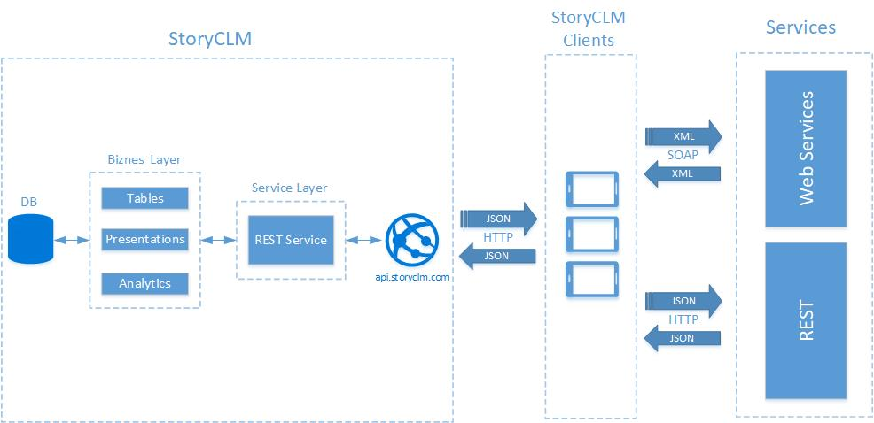

# Интеграция в обход сервера StoryCLM

## Общие положения

Приложение работающее на платформе StoryCLM может напрямую обмеиватся данными с внешними сервисами по протоколу HTTP в обход сервера StoryCLM. Это позволяет встраивать средсва интеграции непосредсвенно в презентацию. Тем самым презентация может выступать в роли тонкого клиента, сервиса, оставаясь при этом тесно связаной с StoryCLM через API. Это позволяет, оставаясь в рамка StoryCLM, используя API StoryCLM и внешниие сервисы, делать гибридные приложения-презентации с расшириным функционалом. [переделать]

Принципиальная схема:



Подобный подход позволяет реализоваь два сценария интеграции:

1. Без участия сервера.
2. Посредник.

**Без участия сервера.** Презентация обменивается сообщениями с REST или SOAP сервисом, посылая запросы. На стороне презентации данные хранятся только в localstorage или не хранятся совсем. Презентация выступает в роли тонкого клиента. StoryCLM в данном случае только управлеят контентом, собирает базовую статистику и управляет пользователями и доступом.[переделать]

Плюсы: 
1. Самый простой и легкий способ интеграции.

Минусы:
1. Нужен постоянный и стабильный интернет.
2. Не очень надежный способ хранения данных на стороне презентации.

**Посредник.** Презентация обменивается данными как с со сторонними сервисами так и с серверной частью StoryCLM. При таком подходе данные хранятся в таблицах и происходит постоянная синхронизация с внешними сервисами. Это удобно елси презентация является агригатором данных из трех источников: стороннего червиса, StoryCLM и пользователей. Например есть презентация с формой, часть данных приходит от внешнего сервиса а часть пользователь воодит вручную, данные собираются и отправляются в StoryCLM и после обработки в сторонние сервисы интегрируемые со StoryCLM. [переделать]

Плюсы: 
1. Централизованное хранение данных. Данные хранятся в StoryCLM и доступны другим презентациям и интегрируемым сервисам.

Минусы:
1. Более сложная реализация.

[полностью переделать весь абзац]

## Интеграция

Интеграция происходит прямо в бизнес логике презентации, путем встраивания туда специального кода.

Библиотека [StoryCLM.JS](https://github.com/storyclm/storyCLM.js) имеет раздел [Http](https://github.com/storyclm/storyCLM.js#http). Этот раздел содержит методы, которые позволяют презентации взаимодействовать с внешними сервисами по протоколу HTTP, отправляя запросы и полчая ответы:

1. Post - отправляет запрос с методом POST;
2. Put - отправляет запрос с методом Put;
3. Get - отправляет запрос с методом Get;
4. Delete - отправляет запрос с методом Delete;


### Запрос

Запрос может состоять из трех частей:

* Body - данные в формате Base64
* Header - объект-коллекция заголовков.
* URL - уникальный идендифкатор ресурса.

**Body**

Тело запроса должно быть в формате Base64, это позволяет передвать по протоколы HTTP практически любые данные от текстовых (формы, json, xml) до бинарных (картинки). Следовательно, любые данные, которые нужно отрпавить в сервис, необходимо закодировать в Base64.

Пример создания тела документа в формате json и кодирование его в Base64:
```
    function utf8_to_b64(str) {
        return window.btoa(str);
    }

    var entry = {
		 userId: 666,
        id: 555,
        title: "test",
        body: "test"
	};

    var body = utf8_to_b64(JSON.stringify(entry, null, 4));
```
В данном примере, создается объект. Так как сервис принимает данные в виде JSON, то используется метод "stringify" класса "JSON" для перевода объекта в текстовый документ в формате JSON. Далее метод "utf8_to_b64" перводит текстовый объект в Base64 строку. Эта строка и будет телом запроса. Если нужно будет отправить обычную форму, то...

**Header**

Если потребуется, можно задать список заголовков. Список заголовков доблжен быть в виде объекта:
```
    var headers = {
        "Accept": "application/json",
        "Accept-Language": "en-us,en;q=0.5",
        "Accept-Charset": "utf-8",
        "Content-Type": "application/json"
    };
```

**URL**

Уникальный идентификатор ресурса.

Тело ответа и заголовки ответа приходят в аналогичных форматах. После получения, тело нужно декодировать из Base64.

## Дполнительные материалы

* [storyclm-js](https://github.com/storyclm/StoryCLM-Samples/tree/master/storyclm.js/storyclm-js) - интерактивный справочник по всем функциям библиотеки с подробным описанием;