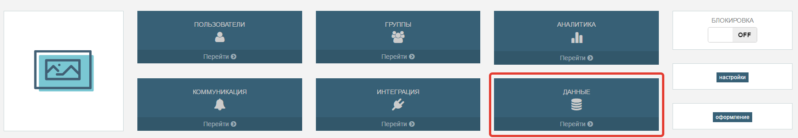

# Таблицы

**Таблицы** - это релиационное хранилище данных.

Таблицы позволяют презентациям и внешним приложениям хранить структурированные данные на сервере, согласно схеме.  Схема определяет какие типы данных может в себе содержать отдельная запись таблицы. Схема состоит их массива пар ключ/значений, где ключ это название поля а значение - его тип.
Ключ это строковое значение и может содержать только символы латиницы в различном регистре, цифры и символы подчеркивания. В одной таблицы ключи не могут повторятся а так же не могут иметь название ключевых полей запроса (см. запрос). Так же нельзя называть поле id или _id. 
Доступные типы данных:

* **Integer**- целое 64-битное число;
* **Double** - число с плавающей точкой;
* **Boolean** - (true/false);
* **String** - строковое значение;
* **Date** - дата в ISO Date формате; 

**ПРИМЕЧАНИЕ**: Стоит отметить, что размерность типов данных может отличатся на разных платформах. Например, long (Int64) в C# имеет максимальное значение 9223372036854775807, а в javascript максимальное целое число - 9007199254740991. Так же, величина типов на разных платформах и устройствах может зависеть от разрядности процессора. Перед использованием таблиц на разных платформах необходимо уточнить эти моменты.

Помимо основных полей схемы, которые пользователь вводит вручную при ее создании, есть поле идендификатор записи в таблице. Поле id - это поле автоматически прикрепляется к схеме данных. id нельзя добавить в схему или удалить из нее. id прикрепляется автоматически к каждой записи при ее создании. id это 12-байтовая строка, уникально генерируемая системой. Идентификатор (id) записи уникален в таблице. Его нельзя изменить для конкретной записи.

Пример схемы таблицы "Profile":

Поле    |  Тип
--------|---------
Name    |  String
Age     |  Integer
Gender  |  Boolean
Rating  |  Double
Created |  Date

Исходя из схемы, в таблице Profile каждая запись будет иметь шесть полей. Пять, которые были созданы пользователем в схеме, и одно системное id.
Таблица с записями будет выглядеть следующим образом:

Таблица: "Profile"

Name      |    Age    |   Gender     |   Rating    |    Created
----------|-----------|--------------|-------------|--------------
"Женя"    |    23     |   false      |   175.7     |    2016-09-29
"Коля"    |    18     |   true       |   190.9     |    2015-11-11
"Вова"    |    11     |   true       |   95.3      |    2015-07-09
"Леша"    |    45     |   true       |   17.0      |    2015-08-07

Данные этой таблицы могут быть использованы разными презентациями, интегрированными приложениями или выгружены для обработки и анализа на локальный компьютер.
Используя средства интеграции,  данные таблицы могут быть выгружены во внешние системы. Так же, через средства интеграции возможна полная синхронизация данных таблицы с хранилищами из внешних источников  в зависимости от типа таблицы.

**Тип таблицы** - это поле указывающее в какой роли (режиме) будет использоваться эта таблица презентациями и внешними приложениями. Для внешних приложений и систем, которые используют таблицы через API , это поле имеет рекомендательных характер и используется в логике интеграции. Может быть установлен один из трех типов (режимов) работы таблиц:

1. **Application**. Это офлайн режим. В этом режиме синхронизация проходит по направлению клиент -> сервер. Во время работы, презентация складывает данные в промежуточное хранилище пока соединение с сервером недоступно.  Как только появится соединение с интернетом, устройство отправит все записи на сервер. В такую таблицу можно добавлять записи из презентации. Эти данные не могут быть изменены из презентации.  Это означает что, операции удаления, редактирования и поиска не доступны для этого типа. Данный тип переводит таблицу в режим лога.
2. **Master**. Это режим - справочник. В этом режиме синхронизация происходит по направлению сервер -> клиент. Данные таблицы заполняются и редактируются на сервере. Таблицы заполняются и редактируются  из внешних приложений, интегрированных систем или на панели администрирования. На клиенте обновляются такие таблицы только при синхронизации. После синхронизации данные этих таблиц в презентациях хранятся в промежуточном хранилище  и доступны на чтение путем выборок данных по запросам. Из презентации в такую таблицу невозможно добавлять, редактировать или удалять записи.
3. **Default**. В таком режиме обмен с данными с таблицей осуществляется напрямую с сервером без промежуточного локального хранилища. Работа с этим типом таблиц возможен в случае установленного подключения к серверу или другими словами когда устройство находится онлайн. С этими таблицами можно выполнять все CRUD операции.

## Создание таблицы

Для того что бы предоставить презентациям или внешнему приложению возможность использовать сервис данных StoryCLM, нужно создать таблицы и их схемы. Создание и управление таблицами в системе возможно на панели администрирования в разделе "Данные".
Нужно перейти под адресу https://admin.storyclm.com/, в один из доступных клиентов и выбрать раздел "Данные".

В разделе "Данные" находится список уже созданных таблиц. Для того что бы создать новую таблицу нужно нажать кнопку "Создать таблицу".

В появившейся форме, система предложит  указать название, выбрать тип таблицы и создать схему. Название таблицы должно быть уникально в пределах одного клиента. Тип таблицы выбирается в зависимости от бизнес логики презентации или логики интеграции с внешними приложениями и интегрируемыми системами. 
После заполнения основных полей и схемы, структура таблицы будет выглядеть примерно так:

Нажмите кнопку "Создать", что бы создать новую таблицу.

Прямо из панели администрирования можно добавить новую запись нажав на "Добавить запись", заполнить поля формы и сохранить данные в таблицу.

После сохранения, появится новая запись.

Через панель администрирования запись можно отредактировать или удалить, используя контекстное меню записи.

## Лог таблицы

Лог таблицы - это история изменений данных в таблице. Лог используется для синхронизации между презентациями, внешними приложениями или интегрируемыми системами и облегчает процесс интеграции. Лог эта таблица состоящая из трех полей:

1. **Дата**. Дата показывающая когда было совершено изменение. 
2. **Идентификатор записи в таблице**. Показывает какая запись подверглась изменению.
3. **Операция**. Тип операции совершенной над записью таблицы. Может быть "Удалена", "Добавлена" и "Отредактирована"

Используя лог таблицы, можно получить историю изменений после определенной даты и выполнить синхронизацию.

Лог таблицы доступен как через API так и на панели администрирования. Что бы перейти в таблицу лога на панели администрирования, нужно в таблице нажать на кнопку "Лог таблицы".

Таблица лога содержит всю историю изменений.

## Допольнительные материалы

* [StoryCLM.JS](https://github.com/storyclm/storyCLM.js) - JS библиотека, через которую можно получить доступ к API таблиц из презентаций;
* [REST API](RESTAPI.md) - можно найти подробную информацию о работе с таблицами, использую REST API систеиы;
* [.NET SDK](https://github.com/storyclm/.NET-SDK) - SDK, для работы с системой на платформе .NET.

