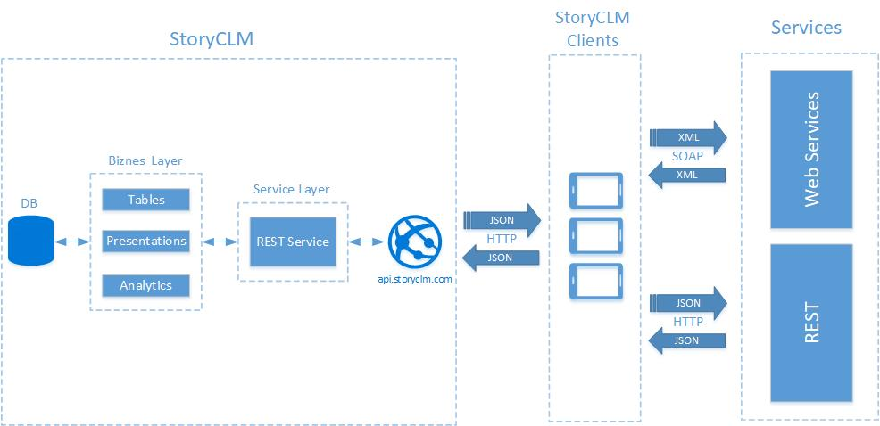

# "Тонкий клиент" и "Концентратор"

## Общие положения

Самый простой способ интеграции. Приложение работающее на платформе StoryCLM может напрямую обмениваться данными с внешними сервисами по протоколу HTTP в обход сервера StoryCLM. Это позволяет встраивать средсва интеграции непосредсвенно в приложение. Тем самым, приложение может выступать в роли тонкого клиента стороннего сервиса, оставаясь при этом тесно связаной с StoryCLM через API. Это позволяет, оставаясь в рамка StoryCLM, используя API StoryCLM и внешниие сервисы, делать гибридные приложения с расшириным функционалом.

Принципиальная схема:



Подобный подход позволяет реализовать два сценария интеграции:

1. Тонкий клиент.
2. Концентратор.

**Тонкий клиент.** Приложение обменивается сообщениями с REST или SOAP сервисом, посылая запросы напрямую. На стороне приложения: графический интерфейс, простая бизнеслогика и логика обмена данными с сервисом. Данные на клиентской стороне хранятся только в localstorage или не хранятся совсем. Презентация выступает в роли тонкого клиента. StoryCLM в данном случае только управлеят контентом и пользователями, собирает базовую статистику. Это самый простой и легкий способ интеграции. 

**Концентратор.** Приложение обменивается данными как со сторонними сервисами так и с серверной частью StoryCLM. При таком подходе, данные хранятся в таблицах StoryCLM и происходит постоянная синхронизация с внешними сервисами. Это удобно, елси презентация является агрегатором данных из трех и больше источников: стороннего сервиса, StoryCLM и данных пользовательского ввода. Частично данные извлекаются из стороннего сервиса, например поля-списки формы. Часть данных вносит пользователь, выбирая элемент списка или заполняя поля формы. Данные из фомы собираются и отправляются в StoryCLM, где они обрабатываются и, если нужно, отправляются в CRM или другой сторонний сервис.

## Интеграция

Библиотека [StoryCLM.JS](https://github.com/storyclm/storyCLM.js) имеет раздел [Http](https://github.com/storyclm/storyCLM.js#http). Этот раздел содержит методы, которые позволяют приложению взаимодействовать с внешними сервисами по протоколу HTTP. Для того, что бы получить доступ к этим методам нужно подключить библиотеку.

**Подключение**

```sh
<script src="js/storyclm-1.7.0.js"></script>
```
Раздел "Http"имеет четыре метода:

1. Post - отправляет запрос с методом POST;
2. Put - отправляет запрос с методом Put;
3. Get - отправляет запрос с методом Get;
4. Delete - отправляет запрос с методом Delete;

Каждый их этих методов посылает запрос к сервису. Запрос может состоять из трех частей:

* Body - данные в формате Base64
* Header - объект-коллекция заголовков.
* URL - уникальный идентифкатор ресурса.

**Body**

Тело запроса должно быть в формате Base64, это позволяет передвать по протоколы HTTP практически любые данные от текстовых (формы, json, xml) до бинарных (картинки). Следовательно, любые данные, которые нужно отрпавить в сервис, необходимо закодировать в Base64.

Пример создания тела документа в формате json и кодирование его в Base64:
```
    function utf8_to_b64(str) {
        return window.btoa(str);
    }

    var entry = {
		 userId: 666,
        id: 555,
        title: "test",
        body: "test"
	};

    var body = utf8_to_b64(JSON.stringify(entry, null, 4));
```
В данном примере, создается объект. Так как сервис принимает данные в виде JSON, то используется метод "stringify" класса "JSON" для перевода объекта в текстовый документ в формате JSON. Далее метод "utf8_to_b64" перводит текстовый объект в Base64 строку. Эта строка и будет телом запроса.

**Header**

Необязательная часть. Если потребуется, можно задать список заголовков. Список заголовков должен быть в виде объекта:
```
    var headers = {
        "Accept": "application/json",
        "Accept-Language": "en-us,en;q=0.5",
        "Accept-Charset": "utf-8",
        "Content-Type": "application/json"
    };
```
**URL**

Уникальный идентификатор ресурса. Конечная точка сервиса.

Тело ответа и заголовки ответа приходят в аналогичных форматах. После получения, тело нужно декодировать из Base64 в ожидаемый формат.

## Методы


#### Method: StoryCLM.Http.Post

```sh
 StoryCLM.Http.Post(url, body, headers, callback);
```
**Описание:**

Отправляет запрос с методом POST.

**Параметры:**

* url - идентификатор (адрес) ресурса.
* body - тело запроса. Строка в формате Base64.
* headers - набор заголовков.
* callback - функция, в которую будет передан результат выполнения операции.

**Запрос:**
```sh
{
    "Command": "httppost",
    "Data": {
        "url": "https://jsonplaceholder.typicode.com/posts",
        "body": "JTI1N0IlMjUwQSUyNTIwJTI1MjAlMjUyMCUyNTIwJTI1MjJ1c2VySWQlMjUyMiUyNTNBJTI1MjA2NjYlMjUyQyUyNTBBJTI1MjAlMjUyMCUyNTIwJTI1MjAlMjUyMmlkJTI1MjIlMjUzQSUyNTIwNTU1JTI1MkMlMjUwQSUyNTIwJTI1MjAlMjUyMCUyNTIwJTI1MjJ0aXRsZSUyNTIyJTI1M0ElMjUyMCUyNTIydGVzdCUyNTIyJTI1MkMlMjUwQSUyNTIwJTI1MjAlMjUyMCUyNTIwJTI1MjJib2R5JTI1MjIlMjUzQSUyNTIwJTI1MjJ0ZXN0JTI1MjIlMjUwQSUyNTdE",
        "headers": {
            "Accept": "application/json",
            "Accept-Language": "en-us,en;q=0.5",
            "Accept-Charset": "utf-8",
            "Content-Type": "application/json"
        }
    }
}
```
**Ответ:**
```sh
{
  "ErrorMessage" : "",
  "Status" : "created",
  "ErrorCode" : 201,
  "Data" : {
    "headers" : {
      "Content-Type" : "application\/json; charset=utf-8",
      "Pragma" : "no-cache",
      "x-powered-by" : "Express",
      "Via" : "1.1 vegur",
      "Server" : "cloudflare-nginx",
      "Expires" : "-1",
      "Cache-Control" : "no-cache",
      "Date" : "Thu, 20 Apr 2017 13:46:15 GMT",
      "access-control-allow-credentials" : "true",
      "Content-Length" : "69",
      "x-content-type-options" : "nosniff",
      "Etag" : "W\/\"45-t\/mYTZNeHjOxV+BVh0Fzsrtii50\"",
      "Vary" : "Origin, X-HTTP-Method-Override, Accept-Encoding",
      "cf-ray" : "35288c76ba8b4e0c-DME"
    },
    "body" : "ewogICJ1c2VySWQiOiA2NjYsCiAgImlkIjogNTU1LAogICJ0aXRsZSI6ICJ0ZXN0IiwKICAiYm9keSI6ICJ0ZXN0Igp9"
  }
}
```
**Тело ответа:**
```sh
{
    "userId": 666,
    "id": 555,
    "title": "test",
    "body": "test"
}
```
--------------------------

#### Method: StoryCLM.Http.Post

```sh
 StoryCLM.Http.Post(url, body, callback);
```
**Описание:**

Отправляет запрос с методом POST.

**Параметры:**

* url - идентификатор (адрес) ресурса.
* body - тело запроса. Строка в формате Base64.
* callback - функция, в которую будет передан результат выполнения операции.

**Запрос:**
```sh
{
    "Command": "httppost",
    "Data": {
        "url": "https://jsonplaceholder.typicode.com/posts",
        "body": "JTI1N0IlMjUwQSUyNTIwJTI1MjAlMjUyMCUyNTIwJTI1MjJ1c2VySWQlMjUyMiUyNTNBJTI1MjA2NjYlMjUyQyUyNTBBJTI1MjAlMjUyMCUyNTIwJTI1MjAlMjUyMmlkJTI1MjIlMjUzQSUyNTIwNTU1JTI1MkMlMjUwQSUyNTIwJTI1MjAlMjUyMCUyNTIwJTI1MjJ0aXRsZSUyNTIyJTI1M0ElMjUyMCUyNTIydGVzdCUyNTIyJTI1MkMlMjUwQSUyNTIwJTI1MjAlMjUyMCUyNTIwJTI1MjJib2R5JTI1MjIlMjUzQSUyNTIwJTI1MjJ0ZXN0JTI1MjIlMjUwQSUyNTdE",
        "headers": {}
    }
}
```
**Ответ:**
```sh
{
  "ErrorMessage" : "",
  "Status" : "created",
  "ErrorCode" : 201,
  "Data" : {
    "headers" : {
      "Content-Type" : "application\/json; charset=utf-8",
      "Pragma" : "no-cache",
      "x-powered-by" : "Express",
      "Via" : "1.1 vegur",
      "Server" : "cloudflare-nginx",
      "Expires" : "-1",
      "Cache-Control" : "no-cache",
      "Date" : "Thu, 20 Apr 2017 13:46:15 GMT",
      "access-control-allow-credentials" : "true",
      "Content-Length" : "69",
      "x-content-type-options" : "nosniff",
      "Etag" : "W\/\"45-t\/mYTZNeHjOxV+BVh0Fzsrtii50\"",
      "Vary" : "Origin, X-HTTP-Method-Override, Accept-Encoding",
      "cf-ray" : "35288c76ba8b4e0c-DME"
    },
    "body" : "ewogICJ1c2VySWQiOiA2NjYsCiAgImlkIjogNTU1LAogICJ0aXRsZSI6ICJ0ZXN0IiwKICAiYm9keSI6ICJ0ZXN0Igp9"
  }
}
```
**Тело ответа:**
```sh
{
    "userId": 666,
    "id": 555,
    "title": "test",
    "body": "test"
}
```
--------------------------
#### Method: StoryCLM.Http.Put

```sh
 StoryCLM.Http.Put(url, body, headers, callback);
```
**Описание:**

Отправляет запрос с методом PUT.

**Параметры:**

* url - идентификатор (адрес) ресурса.
* body - тело запроса. Строка в формате Base64.
* headers - набор заголовков.
* callback - функция, в которую будет передан результат выполнения операции.

**Запрос:**
```sh
{
    "Command": "httpput",
    "Data": {
        "url": "https://jsonplaceholder.typicode.com/posts/1",
        "body": "JTI1N0IlMjUwQSUyNTIwJTI1MjAlMjUyMCUyNTIwJTI1MjJ1c2VySWQlMjUyMiUyNTNBJTI1MjA2NjYlMjUyQyUyNTBBJTI1MjAlMjUyMCUyNTIwJTI1MjAlMjUyMmlkJTI1MjIlMjUzQSUyNTIwNTU1JTI1MkMlMjUwQSUyNTIwJTI1MjAlMjUyMCUyNTIwJTI1MjJ0aXRsZSUyNTIyJTI1M0ElMjUyMCUyNTIydGVzdCUyNTIyJTI1MkMlMjUwQSUyNTIwJTI1MjAlMjUyMCUyNTIwJTI1MjJib2R5JTI1MjIlMjUzQSUyNTIwJTI1MjJ0ZXN0JTI1MjIlMjUwQSUyNTdE",
        "headers": {
            "Accept": "application/json",
            "Accept-Language": "en-us,en;q=0.5",
            "Accept-Charset": "utf-8",
            "Content-Type": "application/json"
        }
    }
}
```
**Ответ:**
```sh
{
  "ErrorMessage" : "",
  "Status" : "no error",
  "ErrorCode" : 200,
  "Data" : {
    "headers" : {
      "Content-Type" : "application\/json; charset=utf-8",
      "Pragma" : "no-cache",
      "x-powered-by" : "Express",
      "Via" : "1.1 vegur",
      "Server" : "cloudflare-nginx",
      "Content-Encoding" : "gzip",
      "Expires" : "-1",
      "Cache-Control" : "no-cache",
      "Date" : "Thu, 20 Apr 2017 13:48:38 GMT",
      "access-control-allow-credentials" : "true",
      "x-content-type-options" : "nosniff",
      "Etag" : "W\/\"43-PsA+O8XAGFcGfXof\/Wtj7IAtJBA\"",
      "Vary" : "Origin, Accept-Encoding",
      "cf-ray" : "35288ff4e95e4e0c-DME"
    },
    "body" : "ewogICJ1c2VySWQiOiA2NjYsCiAgImlkIjogMSwKICAidGl0bGUiOiAidGVzdCIsCiAgImJvZHkiOiAidGVzdCIKfQ=="
  }
}
```
**Тело ответа:**
```sh
{
    "userId": 666,
    "id": 555,
    "title": "test",
    "body": "test"
}
```
--------------------------
#### Method: StoryCLM.Http.Put

```sh
 StoryCLM.Http.Put(url, body, callback);
```
**Описание:**

Отправляет запрос с методом PUT.

**Параметры:**

* url - идентификатор (адрес) ресурса.
* body - тело запроса. Строка в формате Base64.
* callback - функция, в которую будет передан результат выполнения операции.

**Запрос:**
```sh
{
    "Command": "httpput",
    "Data": {
        "url": "https://jsonplaceholder.typicode.com/posts/1",
        "body": "JTI1N0IlMjUwQSUyNTIwJTI1MjAlMjUyMCUyNTIwJTI1MjJ1c2VySWQlMjUyMiUyNTNBJTI1MjA2NjYlMjUyQyUyNTBBJTI1MjAlMjUyMCUyNTIwJTI1MjAlMjUyMmlkJTI1MjIlMjUzQSUyNTIwNTU1JTI1MkMlMjUwQSUyNTIwJTI1MjAlMjUyMCUyNTIwJTI1MjJ0aXRsZSUyNTIyJTI1M0ElMjUyMCUyNTIydGVzdCUyNTIyJTI1MkMlMjUwQSUyNTIwJTI1MjAlMjUyMCUyNTIwJTI1MjJib2R5JTI1MjIlMjUzQSUyNTIwJTI1MjJ0ZXN0JTI1MjIlMjUwQSUyNTdE",
        "headers": {}
    }
}
```
**Ответ:**
```sh
{
  "ErrorMessage" : "",
  "Status" : "no error",
  "ErrorCode" : 200,
  "Data" : {
    "headers" : {
      "Content-Type" : "application\/json; charset=utf-8",
      "Pragma" : "no-cache",
      "x-powered-by" : "Express",
      "Via" : "1.1 vegur",
      "Server" : "cloudflare-nginx",
      "Content-Encoding" : "gzip",
      "Expires" : "-1",
      "Cache-Control" : "no-cache",
      "Date" : "Thu, 20 Apr 2017 13:48:38 GMT",
      "access-control-allow-credentials" : "true",
      "x-content-type-options" : "nosniff",
      "Etag" : "W\/\"43-PsA+O8XAGFcGfXof\/Wtj7IAtJBA\"",
      "Vary" : "Origin, Accept-Encoding",
      "cf-ray" : "35288ff4e95e4e0c-DME"
    },
    "body" : "ewogICJ1c2VySWQiOiA2NjYsCiAgImlkIjogMSwKICAidGl0bGUiOiAidGVzdCIsCiAgImJvZHkiOiAidGVzdCIKfQ=="
  }
}
```
**Тело ответа:**
```sh
{
    "userId": 666,
    "id": 555,
    "title": "test",
    "body": "test"
}
```
--------------------------
#### Method: StoryCLM.Http.Get

```sh
 StoryCLM.Http.Get(url, headers, callback);
```
**Описание:**

Отправляет запрос с методом Get.

**Параметры:**

* url - идентификатор (адрес) ресурса.
* headers - набор заголовков.
* callback - функция, в которую будет передан результат выполнения операции.

**Запрос:**
```sh
{
    "Command": "httpget",
    "Data": {
        "url": "https://jsonplaceholder.typicode.com/posts/1",
        "headers": {
            "Accept": "application/json",
            "Accept-Language": "en-us,en;q=0.5",
            "Accept-Charset": "utf-8",
            "Content-Type": "application/json"
        }
    }
}
```
**Ответ:**
```sh
 {
  "ErrorMessage" : "",
  "Status" : "no error",
  "ErrorCode" : 200,
  "Data" : {
    "headers" : {
      "Content-Type" : "application\/json; charset=utf-8",
      "Pragma" : "no-cache",
      "x-powered-by" : "Express",
      "Via" : "1.1 vegur",
      "Server" : "cloudflare-nginx",
      "Content-Encoding" : "gzip",
      "Expires" : "Thu, 20 Apr 2017 17:49:25 GMT",
      "cf-cache-status" : "HIT",
      "Cache-Control" : "public, max-age=14400",
      "Date" : "Thu, 20 Apr 2017 13:49:25 GMT",
      "access-control-allow-credentials" : "true",
      "x-content-type-options" : "nosniff",
      "Etag" : "W\/\"124-yiKdLzqO5gfBrJFrcdJ8Yq0LGnU\"",
      "Vary" : "Accept-Encoding",
      "cf-ray" : "3528911c8b8c4e0c-DME"
    },
    "body" : "ewogICJ1c2VySWQiOiAxLAogICJpZCI6IDEsCiAgInRpdGxlIjogInN1bnQgYXV0IGZhY2VyZSByZXBlbGxhdCBwcm92aWRlbnQgb2NjYWVjYXRpIGV4Y2VwdHVyaSBvcHRpbyByZXByZWhlbmRlcml0IiwKICAiYm9keSI6ICJxdWlhIGV0IHN1c2NpcGl0XG5zdXNjaXBpdCByZWN1c2FuZGFlIGNvbnNlcXV1bnR1ciBleHBlZGl0YSBldCBjdW1cbnJlcHJlaGVuZGVyaXQgbW9sZXN0aWFlIHV0IHV0IHF1YXMgdG90YW1cbm5vc3RydW0gcmVydW0gZXN0IGF1dGVtIHN1bnQgcmVtIGV2ZW5pZXQgYXJjaGl0ZWN0byIKfQ=="
  }
}
```
**Тело ответа:**
```sh
{
	userId: 1,
	id: 1,
	title: "sunt aut facere repellat provident occaecati excepturi optio reprehenderit",
	body: "quia et suscipit suscipit recusandae consequuntur expedita et cum reprehenderit molestiae ut ut quas totam nostrum rerum est autem sunt rem eveniet architecto"
}
```
--------------------------
#### Method: StoryCLM.Http.Get

```sh
 StoryCLM.Http.Get(url, callback);
```
**Описание:**

Отправляет запрос с методом Get.

**Параметры:**

* url - идентификатор (адрес) ресурса.
* callback - функция, в которую будет передан результат выполнения операции.

**Запрос:**
```sh
{
    "Command": "httpget",
    "Data": {
        "url": "https://jsonplaceholder.typicode.com/posts/1"
    }
}
```
**Ответ:**
```sh
 {
  "ErrorMessage" : "",
  "Status" : "no error",
  "ErrorCode" : 200,
  "Data" : {
    "headers" : {
      "Content-Type" : "application\/json; charset=utf-8",
      "Pragma" : "no-cache",
      "x-powered-by" : "Express",
      "Via" : "1.1 vegur",
      "Server" : "cloudflare-nginx",
      "Content-Encoding" : "gzip",
      "Expires" : "Thu, 20 Apr 2017 17:49:25 GMT",
      "cf-cache-status" : "HIT",
      "Cache-Control" : "public, max-age=14400",
      "Date" : "Thu, 20 Apr 2017 13:49:25 GMT",
      "access-control-allow-credentials" : "true",
      "x-content-type-options" : "nosniff",
      "Etag" : "W\/\"124-yiKdLzqO5gfBrJFrcdJ8Yq0LGnU\"",
      "Vary" : "Accept-Encoding",
      "cf-ray" : "3528911c8b8c4e0c-DME"
    },
    "body" : "ewogICJ1c2VySWQiOiAxLAogICJpZCI6IDEsCiAgInRpdGxlIjogInN1bnQgYXV0IGZhY2VyZSByZXBlbGxhdCBwcm92aWRlbnQgb2NjYWVjYXRpIGV4Y2VwdHVyaSBvcHRpbyByZXByZWhlbmRlcml0IiwKICAiYm9keSI6ICJxdWlhIGV0IHN1c2NpcGl0XG5zdXNjaXBpdCByZWN1c2FuZGFlIGNvbnNlcXV1bnR1ciBleHBlZGl0YSBldCBjdW1cbnJlcHJlaGVuZGVyaXQgbW9sZXN0aWFlIHV0IHV0IHF1YXMgdG90YW1cbm5vc3RydW0gcmVydW0gZXN0IGF1dGVtIHN1bnQgcmVtIGV2ZW5pZXQgYXJjaGl0ZWN0byIKfQ=="
  }
}
```
**Тело ответа:**
```sh
{
	userId: 1,
	id: 1,
	title: "sunt aut facere repellat provident occaecati excepturi optio reprehenderit",
	body: "quia et suscipit suscipit recusandae consequuntur expedita et cum reprehenderit molestiae ut ut quas totam nostrum rerum est autem sunt rem eveniet architecto"
}
```
--------------------------
#### Method: StoryCLM.Http.Delete

```sh
 StoryCLM.Http.Delete(url, headers, callback);
```
**Описание:**

Отправляет запрос с методом Delete.

**Параметры:**

* url - идентификатор (адрес) ресурса.
* headers - набор заголовков.
* callback - функция, в которую будет передан результат выполнения операции.

**Запрос:**
```sh
{
    "Command": "httpdelete",
    "Data": {
        "url": "https://jsonplaceholder.typicode.com/posts/1",
        "headers": {
            "Accept": "application/json",
            "Accept-Language": "en-us,en;q=0.5",
            "Accept-Charset": "utf-8",
            "Content-Type": "application/json"
        }
    }
}
```
**Ответ:**
```sh
 {
  "ErrorMessage" : "",
  "Status" : "no error",
  "ErrorCode" : 200,
  "Data" : {
    "headers" : {
      "Content-Type" : "application\/json; charset=utf-8",
      "Pragma" : "no-cache",
      "x-powered-by" : "Express",
      "Via" : "1.1 vegur",
      "Server" : "cloudflare-nginx",
      "Content-Encoding" : "gzip",
      "Expires" : "Thu, 20 Apr 2017 17:49:25 GMT",
      "cf-cache-status" : "HIT",
      "Cache-Control" : "public, max-age=14400",
      "Date" : "Thu, 20 Apr 2017 13:49:25 GMT",
      "access-control-allow-credentials" : "true",
      "x-content-type-options" : "nosniff",
      "Etag" : "W\/\"124-yiKdLzqO5gfBrJFrcdJ8Yq0LGnU\"",
      "Vary" : "Accept-Encoding",
      "cf-ray" : "3528911c8b8c4e0c-DME"
    },
    "body" : "ewogICJ1c2VySWQiOiAxLAogICJpZCI6IDEsCiAgInRpdGxlIjogInN1bnQgYXV0IGZhY2VyZSByZXBlbGxhdCBwcm92aWRlbnQgb2NjYWVjYXRpIGV4Y2VwdHVyaSBvcHRpbyByZXByZWhlbmRlcml0IiwKICAiYm9keSI6ICJxdWlhIGV0IHN1c2NpcGl0XG5zdXNjaXBpdCByZWN1c2FuZGFlIGNvbnNlcXV1bnR1ciBleHBlZGl0YSBldCBjdW1cbnJlcHJlaGVuZGVyaXQgbW9sZXN0aWFlIHV0IHV0IHF1YXMgdG90YW1cbm5vc3RydW0gcmVydW0gZXN0IGF1dGVtIHN1bnQgcmVtIGV2ZW5pZXQgYXJjaGl0ZWN0byIKfQ=="
  }
}
```
**Тело ответа:**
```sh
{}
```
--------------------------
#### Method: StoryCLM.Http.Delete

```sh
 StoryCLM.Http.Delete(url, headers, callback);
```
**Описание:**

Отправляет запрос с методом Delete.

**Параметры:**

* url - идентификатор (адрес) ресурса.
* callback - функция, в которую будет передан результат выполнения операции.

**Запрос:**
```sh
{
    "Command": "httpdelete",
    "Data": {
        "url": "https://jsonplaceholder.typicode.com/posts/1"
    }
}
```
**Ответ:**
```sh
 {
  "ErrorMessage" : "",
  "Status" : "no error",
  "ErrorCode" : 200,
  "Data" : {
    "headers" : {
      "Content-Type" : "application\/json; charset=utf-8",
      "Pragma" : "no-cache",
      "x-powered-by" : "Express",
      "Via" : "1.1 vegur",
      "Server" : "cloudflare-nginx",
      "Content-Encoding" : "gzip",
      "Expires" : "Thu, 20 Apr 2017 17:49:25 GMT",
      "cf-cache-status" : "HIT",
      "Cache-Control" : "public, max-age=14400",
      "Date" : "Thu, 20 Apr 2017 13:49:25 GMT",
      "access-control-allow-credentials" : "true",
      "x-content-type-options" : "nosniff",
      "Etag" : "W\/\"124-yiKdLzqO5gfBrJFrcdJ8Yq0LGnU\"",
      "Vary" : "Accept-Encoding",
      "cf-ray" : "3528911c8b8c4e0c-DME"
    },
    "body" : "ewogICJ1c2VySWQiOiAxLAogICJpZCI6IDEsCiAgInRpdGxlIjogInN1bnQgYXV0IGZhY2VyZSByZXBlbGxhdCBwcm92aWRlbnQgb2NjYWVjYXRpIGV4Y2VwdHVyaSBvcHRpbyByZXByZWhlbmRlcml0IiwKICAiYm9keSI6ICJxdWlhIGV0IHN1c2NpcGl0XG5zdXNjaXBpdCByZWN1c2FuZGFlIGNvbnNlcXV1bnR1ciBleHBlZGl0YSBldCBjdW1cbnJlcHJlaGVuZGVyaXQgbW9sZXN0aWFlIHV0IHV0IHF1YXMgdG90YW1cbm5vc3RydW0gcmVydW0gZXN0IGF1dGVtIHN1bnQgcmVtIGV2ZW5pZXQgYXJjaGl0ZWN0byIKfQ=="
  }
}
```
**Тело ответа:**
```sh
{}
```
--------------------------

## Дполнительные материалы

* [storyclm-js](https://github.com/storyclm/StoryCLM-Samples/tree/master/storyclm.js/storyclm-js) - интерактивный справочник по всем функциям библиотеки с подробным описанием;